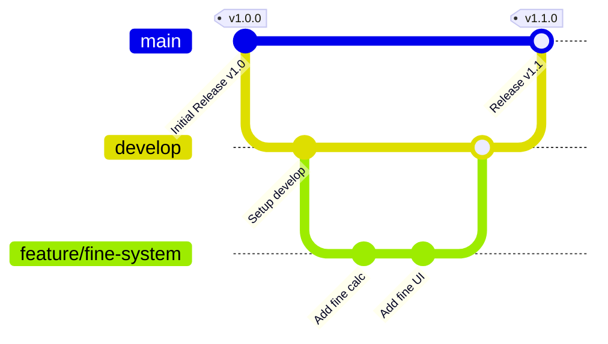

# Contributing to L.A.M.E.

Welcome! This guide will help you get started with contributing to the **Library Automation Management Entity (L.A.M.E.)** project. We use Git for version control and collaborative development.

---

## 1. Git Branching Strategy

We use a branching model derived from Git Flow to organize our codebase. It consists of three main types of branches:



### Core Branches
*   **`main`**: Represents production-ready code. Commits here are only made by merging `develop` when a new version/release is ready.
*   **`develop`**: The main integration branch. All features are merged here and tested before being pushed to `main`.

### Temporary Branches
*   **`feature/*`**: Used for developing new features. Branch names should be descriptive, e.g., `feature/admin-panel`, `feature/fine-system`, or `feature/reservation`. Feature branches start from `develop` and must be merged back into `develop`.

---

## 2. Standard Development Workflow

Follow these steps to propose changes:

### Step 1: Sync Your Branches
Before starting, ensure your local `develop` branch is up to date:
```bash
git checkout develop
git pull origin develop
```

### Step 2: Create a Feature Branch
Create a new branch off `develop` named after the feature you are building:
```bash
git checkout -b feature/your-feature-name
```
*Example:* `git checkout -b feature/fine-system`

### Step 3: Write Code and Commit
As you build the feature, commit your changes with clear, descriptive messages:
```bash
git add file.php
git commit -m "feat: implement fine calculation formula"
```

### Step 4: Push the Feature Branch
Push your branch to the remote repository:
```bash
git push origin feature/your-feature-name
```

---

## 3. Pull Requests (PRs)

A **Pull Request** is a request to merge changes from your feature branch into the `develop` branch. It allows other developers to review your code, discuss improvements, and verify functionality before integration.

### Creating a Pull Request
1. Go to the project repository on GitHub.
2. Click **Compare & pull request** next to your pushed feature branch.
3. Set the **base branch** to `develop` and the **compare branch** to `feature/your-feature-name`.
4. Fill out the description using our Pull Request Template (it will auto-populate).
5. Request reviews from other developers.

### Merging
Once the code is approved and passes manual/automated tests, the PR is merged into `develop`.

---

## 4. Resolving Merge Conflicts

A **Merge Conflict** occurs when Git cannot automatically merge two branches. This usually happens when two developers modify the same line in a file on different branches, or when one developer deletes a file that another is modifying.

### How to Resolve a Conflict
If your PR has a conflict, follow these steps locally:

1. Checkout `develop` and make sure it is up-to-date:
   ```bash
   git checkout develop
   git pull origin develop
   ```
2. Switch back to your feature branch:
   ```bash
   git checkout feature/your-feature-name
   ```
3. Merge `develop` into your feature branch:
   ```bash
   git merge develop
   ```
4. Git will output a list of conflicted files. Open them in your editor. You will see conflict markers:
   ```php
   <<<<<<< HEAD
   // Your new code in feature/your-feature-name
   $fine = $days * 1.50;
   =======
   // Code currently in develop branch
   $fine = $days * 2.00;
   >>>>>>> develop
   ```
5. **Resolve the conflict** by editing the code to keep the correct logic and removing the markers (`<<<<<<<`, `=======`, `>>>>>>>`).
6. Stage the resolved files and commit:
   ```bash
   git add resolved_file.php
   git commit -m "chore: resolve merge conflicts with develop"
   ```
7. Push your branch back to GitHub:
   ```bash
   git push origin feature/your-feature-name
   ```

---

## 5. Issue Tracking

We use **GitHub Issues** to track bugs, plan features, and organize milestones.

*   **Reporting a Bug**: Use the **Bug Report Template**. Describe the exact environment, provide steps to reproduce, and specify the expected behavior.
*   **Requesting a Feature**: Use the **Feature Request Template**. Describe the problem you want to solve, your proposed solution, and any alternatives you've considered.
*   **Assigning Work**: Team members can assign issues to themselves so that multiple developers do not duplicate efforts on the same task.

---

## 6. Releases

A **Release** represents a stable version of our application that is deployed to staging or production.

1. When `develop` contains a complete set of features and is fully tested, merge it into `main`:
   ```bash
   git checkout main
   git merge develop
   ```
2. Tag the release version on `main` using semantic versioning (e.g., `v1.1.0`):
   ```bash
   git tag -a v1.1.0 -m "Release version 1.1.0"
   ```
3. Push the tag to GitHub:
   ```bash
   git push origin main --tags
   ```
4. On GitHub, navigate to **Releases** $\rightarrow$ **Draft a new release**, select your tag, name the release, and write release notes summarizing the new features and bug fixes.
